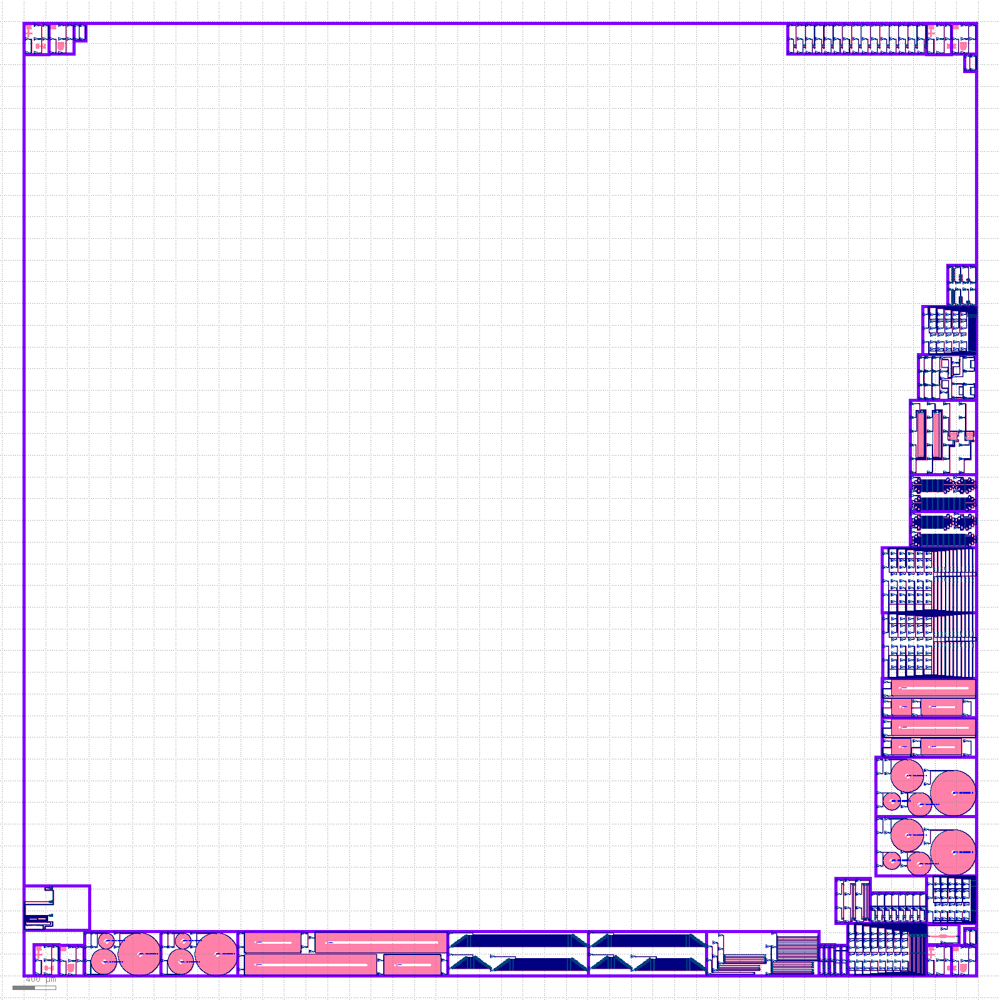

# Shuksan laser integration Design Submissions

# Fabrication process: Passive Silicon
## Technical summary:
- SOI wafer, 220 nm silicon
- Process:
  - Single full etch, using a positive resist
  - Air cladding
  - Laser integration
- Process Design Kit: [SiEPIC-EBeam-PDK](https://github.com/SiEPIC/SiEPICfab-EBeam-ZEP-PDK)

# Submission instructions:

The submission involves several steps. First, you need to create your design(s) using the process design kit (PDK) for this specific fabrication run. Then you need to create a Fork of this repository, commit your design(s), ensure that it passes the checks, and create a pull request. Once your pull request is approved, your design(s) will be merged into the layout for fabrication. You should verify that your design is correctly merged. Once the designs are fabricated, they will be tested, and the measurement results will be posted in this repository.

## Design software and PDK installation instructions:
 - Design tools and process design kit installation instructinos

## Submission via GitHub
 - [Watch this video for a demonstration](https://kaltura.clemson.edu/media/t/1_iwysnxub)
 - Create an account on GitHub
 - Fork a copy of this GitHub repository into your own account:  <a href="../../fork">Create a new fork</a>.
 - Turn on the GitHub Actions on your forked repository: <a href="../../actions">Actions</a> (In your repository's page on GitHub, click on Actions in the top-menu bar, and Enable the workflows).
 - [Optional] Install GitHub Desktop (or git) on your computer, and Clone a local copy: <a href="x-github-client://openRepo/https://github.com/SiEPIC/openEBL-2025-02">Open with GitHub Desktop</a>
 - Create your design, and ensure that the filename contains your <a href="https://www.edx.org/learn/engineering/university-of-british-columbia-silicon-photonics-design-fabrication-and-data-ana">edX.org</a> (or GitHub username if the edX one is a random string that does not contain your name), and be formatted according to the course/workshop as follows:
   - EBeam_username.oas: for the <a href="https://www.edx.org/learn/engineering/university-of-british-columbia-silicon-photonics-design-fabrication-and-data-ana">edX Phot1x silicon photonics design course</a>
   - ELEC413_username.oas: for the <a href="https://ece.ubc.ca/courses/elec-413/">UBC ELEC 413 course</a>
   - SiEPIC_Passives_username.oas: for the <a href="https://fabricinnovation.ca/workshop-passive-silicon-photonics-fabrication-2024">CMC SiEPIC Passives silicon photonics workshop</a>
   - openEBL_username.gds: for past participants in the above courses, conference short courses
   - For example: EBeam_LukasChrostowski_rings.oas
 - Ensure that your fork is up to date with the main SiEPIC repository.  Click "Sync fork" 
 - Upload your design(s) into the "submissions" folder, as a binary file, namely a .gds (GDSII format) or .oas (OASIS format) file. 
    - This can be done via the GitHub web page, by navigating to the <a href=../../tree/main/submissions>submissions folder</a>, then clicking on Add file, and Upload files. 
    - Click Commit changes, and wait for the verification (via GitHub actions) to complete. This will appear as a green checkmark or red X next to your commit on GitHub. 
    - If there are errors, please review and correct the errors.
    - Please run your verification locally (press V in KLayout), or download the output .lydrb verification file from GitHub and open in KLayout.
 -  Look for errors -- "All checks have failed" 
    - Click on Details
    - In the main, window expand the "Run layout verification"; see if there is a text description of the problem
    - Look for the Artifact file; download it and open it in KLayout
  - After fixing the errors, you should have a green check mark as follows:    
- Alternatively upload your Python file, which will be compiled by a GitHub Action.  
   - For KLayout designs, use the "submissions/KLayout Python" folder, namely a .py (Python format) file.  e.g., EBeam_LukasChrostowski_MZI.py.  The Python file should save a gds or oas file into the parent "submissions" folder. The Python script needs to be executable in non-GUI mode, namely using "import klayout SiEPIC SiEPIC-EBeam-PDK"
 - Create a <a href="https://help.github.com/articles/using-pull-requests/">Pull Request</a> -- this will notify the team of your contribution, which we can aggregate into the main design file
 - Return to the main repository, and ensure that your design is correctly merged. Download the Latest Merge file, below.

## Black-box cells (IP Replacement)
- We perform IP replacement on several cells (grating couplers). We call these cells Black Box (BB), and you can identify them by _BB in the cell name, or the presence of the Blackbox layer 998/0 in the cell.
- You must not change the name of the cell, the contents, nor cell origins. Otherwise, the replacement will not work correctly.

## FYI – Automated GitHub Actions
The verification and merging is performed using GitHub actions. The repository implements the following:
1) Running the Python files in the "submissions/KLayout Python" folder, to generate the designs
2) Performing Manufacturing DRC verification on the designs in the "submissions" folder, and outputing the errors as an Artifact
3) Performing Functional verification on the designs in the "submissions" folder, and outputing the errors as an Artifact
4) Merging the designs from the "submissions" folder, and outputing merged layout as an Artifact in the main repository

## Latest Merge Layout File

Click on the following link to download the EBeam.oas merged layout file:
<!-- start-link -->
https://github.com/SiEPIC/UBC-ELEC413-2025/actions/runs/13112274340/artifacts/2526354115
<!-- end-link -->
